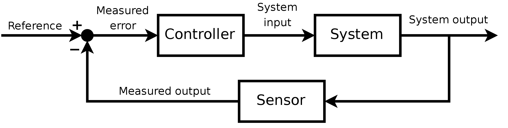

# PI-Temperature-Regulator

## Getting Started

### Prerequisites

- [git](https://git-scm.com/downloads)
- [Docker Desktop](https://www.docker.com/get-started)
- [Visual Studio Code](https://code.visualstudio.com/)
  - Add Extension `ms-vscode-remote.remote-containers`

### Installation

- Get the repo:
  ```ssh
  git clone https://github.com/Tamaluga/pi-regulator
  ```
- Start `Docker Desktop`
- Open the project folder in VS Code.  
  Press `ctrl+shift+p` to open the command palette and enter `Remote-Containers: Reopen in Container`.

### Build

- Open the internal terminal in VS Code
  Press `ctrl+shift+p` to open the command palette and enter `Toggle Integrated Terminal`.
- Build the tests
  - Over the control menu of vs code (choose a Kit/GCC first and then hit the build button)
  - With the scripts in the tools folder:
  ```ssh
  ./tools/build_tests.sh
  ```
  - Via the terminal
  ```ssh
  mkdir build
  cd build
  cmake -S .. -B .
  cmake --build .
  ```

## Status

### Regulator

Regulator.h/.c contains an example implementation for a pid regulator.
To use it as an pi regulator just set the differential factor kd to zero.

The naming of the regulator parameters is done according to feedback loop model.


An example how to use the regulator can be found under tests/regulate

TODO:
- Test the regulator on a real world feedback loop

### Autotuner

pidautotuner.h/.c contains the implementation for a pid autotuner to measure the needed factors kp, ki and kd instead of calculating them. The autotuner uses the Ziegler-Nichols tuning method.
This software snippet is originally from the following git repo: https://github.com/jackw01/arduino-pid-autotuner 

An example how to use the autotuner can be found under tests/autotune.

TODO:
- Adapt the autotuner for pi autotuning
  - Adjust kpConstant, tiConstant, tdConstant according to table: https://en.wikipedia.org/wiki/Ziegler%E2%80%93Nichols_method
  - Check if thats enough or if calculation has to be adjusted as well
- Test the autotuner on a real world feedback loop